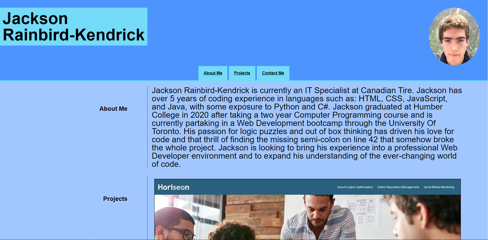

# Create-Portfolio-Site

## Description
This repository serves as a portfolio website containing information about myself, showcase projects, as well as my contact information.

## Links
GitHub: https://github.com/JacksonR-K/Create-Portfolio-Site

GitHub Pages: https://jacksonr-k.github.io/Create-Portfolio-Site/

## Credits

https://alignedonline.com/non%E2%80%91breaking-spaces/ 

https://stackoverflow.com/questions/90178/make-a-div-fill-the-height-of-the-remaining-screen-space

https://stackoverflow.com/questions/796087/make-a-div-into-a-link
